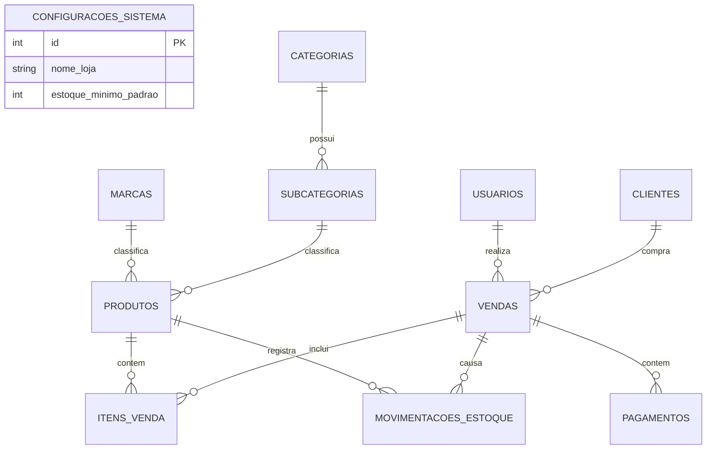

# Estrutura do Banco de Dados (Modelagem V2)

O banco de dados utiliza SQLite e está estritamente normalizado (1NF, 2NF, 3NF), suportando a Modelagem V2.

## Tabelas e Relacionamentos

1. **`usuarios`**: Perfis de acesso (`ADMINISTRADOR`, `VENDEDOR`), e-mail, senha criptografada.
2. **`configuracoes_sistema`**: Chaves globais (ex: Estoque mínimo padrão).
3. **`clientes`**: Dados básicos do cliente (Nome, CPF, Contato).
4. **`categorias`**, **`subcategorias`**, **`marcas`**: Estrutura hierárquica do catálogo.
5. **`produtos`**: Referencia subcategoria e marca, possui preço atual, custo atual e estoque_atual.
6. **`vendas`**:
   - `usuario_id` → `usuarios.id` (quem realizou a venda)
   - `cliente_id` → `clientes.id` (para quem foi a venda)
7. **`itens_venda`**:
   - `produto_id` → `produtos.id`
   - Armazena `custo_unitario` histórico, travando o custo no momento da venda para relatórios financeiros precisos (sem quebrar a forma normal com totalizadores derivados de lucro).
8. **`pagamentos`**: Vínculo 1:N com `vendas`.
9. **`movimentacoes_estoque`**: Histórico detalhado de entradas e saídas de produtos.

## Diagrama (Mermaid)

## Arquivos Relacionados
- `database/schema.sql`: DDL com todas as tabelas, Constraints (PK, FK, CHECK).
- `database/seed.sql`: DML com a massa de dados inicial (mock) para testes.
